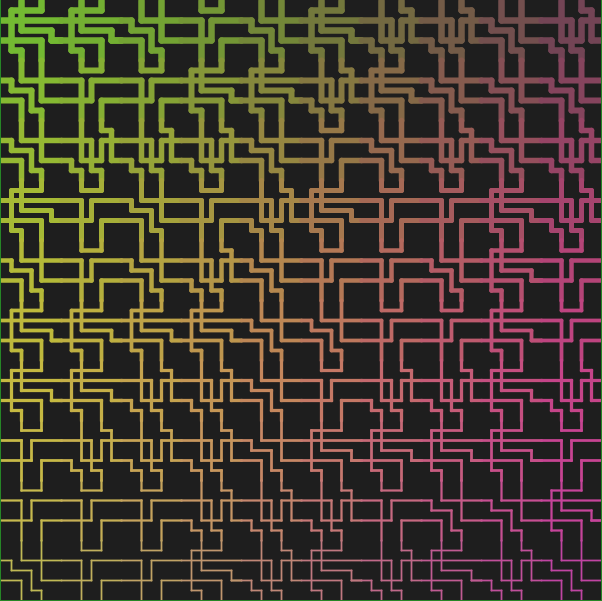

# Truchet
### Three examples of Truchet tiles

## What does it do?
The code in this repo generates three distinct random types of Truchet tiling:
1. Quarter-circles
2. Bull-heads
3. Rectangles

Each type of tiling is drawn on a dark grey background.
The tiles themselves are drawn in a randomly generated color palette which migrates across the scene. 
The stroke weight also varies smoothly between two variables.

## Examples
1. Quarter-circles (notice the lighter stroke weight towards the bottom of the scene): 

2. Bull-heads (notice the lighter stroke weight towards the top of the scene): 

3. Rectangles (notice the lighter stroke weight towards the bottom of the scene): 

## Variables
There are a number of variables that can be manipulated:
* width - width of the scene
* height - height of the scene
* ratio - ratio between the dimentions of the scene and the number of tile columns and rows
* type - the type of tiling to be used:
  * Quarter-circles (type 0)
  * Bull-heads (type 1)
  * Rectangles (type 2)
* r - the red value of the stroke (affected by time, and the y location of the stroke)
* g - the green value of the stroke (affected by time, and the x location of the stroke)
* b - the blue value of the stroke (affected by time, the x location and the y location of the stroke)
* weight - the weight of the stroke (affected by time and the y location of the stroke, bound between two values)
